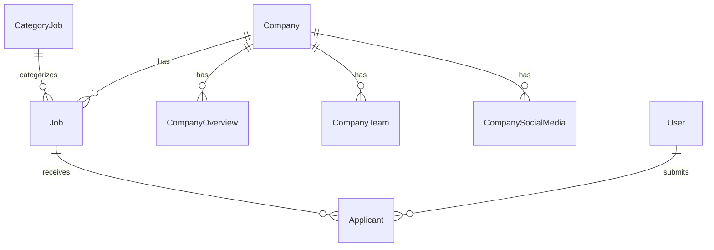

# 02 - Database

## Database Provider

**PostgreSQL** hosted on **Supabase**

---

## Schema Overview

---

## Models

### Company

| Field    | Type            | Description     |
| -------- | --------------- | --------------- |
| id       | String (cuid)   | Primary key     |
| name     | String          | Company name    |
| email    | String (unique) | Login email     |
| password | String          | Hashed password |

**Relations**: `CompanySocialMedia`, `CompanyTeam`, `CompanyOverview`, `Job`

---

### Job

| Field          | Type          | Description               |
| -------------- | ------------- | ------------------------- |
| id             | String (cuid) | Primary key               |
| roles          | String        | Job title                 |
| datePosted     | DateTime      | Post date                 |
| dueDate        | DateTime      | Application deadline      |
| jobType        | String        | Full-time, Part-time, etc |
| applicants     | Int           | Current applicants count  |
| needs          | Int           | Positions available       |
| salaryFrom     | String        | Minimum salary            |
| salaryTo       | String        | Maximum salary            |
| requiredSkills | String[]      | Required skills array     |
| description    | String        | Job description           |
| responsibility | String        | Job responsibilities      |
| whoYouAre      | String        | Candidate requirements    |
| niceToHaves    | String        | Preferred qualifications  |
| benefits       | Json          | Job benefits              |

**Relations**: `Company`, `CategoryJob`, `Applicant`

---

### User

| Field    | Type            | Description     |
| -------- | --------------- | --------------- |
| id       | String (cuid)   | Primary key     |
| name     | String          | Full name       |
| email    | String (unique) | Email address   |
| password | String          | Hashed password |

**Relations**: `Applicant`

---

### Applicant

| Field            | Type          | Description        |
| ---------------- | ------------- | ------------------ |
| id               | String (cuid) | Primary key        |
| userId           | String        | Applicant user ID  |
| jobId            | String        | Applied job ID     |
| previousJobTitle | String        | Previous job title |
| phone            | String        | Contact number     |
| linkedin         | String        | LinkedIn URL       |
| portfolio        | String        | Portfolio URL      |
| coverLetter      | String        | Cover letter       |
| resume           | String        | Resume URL         |

---

## Supporting Models

### CompanyOverview

Company profile information (website, location, tech stack, description)

### CompanyTeam

Team members with social links

### CompanySocialMedia

Company social media links

### CategoryJob

Job categories for filtering

### Industry

Industry types for companies
