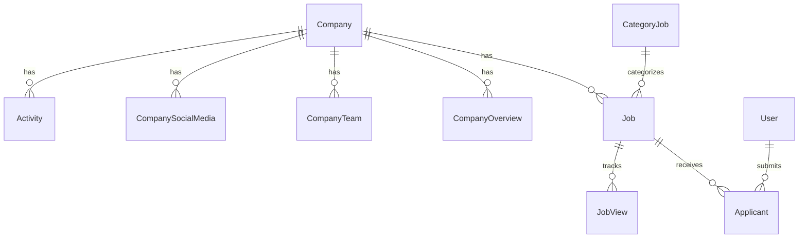

# architecture.md - The Rules

> Dokumentasi struktur aplikasi, data model, dan schema database untuk hired.io.

---

## Application Architecture

```
┌─────────────────────────────────────────────────────────────┐
│                        Client Layer                         │
│  ┌─────────────────┐  ┌─────────────────────────────────┐  │
│  │  Landing Pages  │  │        Dashboard (Admin)        │  │
│  │  - Home         │  │  - Job Management               │  │
│  │  - Jobs         │  │  - Applicant Tracking           │  │
│  │  - Companies    │  │  - Settings                     │  │
│  │  - Auth         │  │  - Analytics                    │  │
│  └─────────────────┘  └─────────────────────────────────┘  │
└────────────────────────────┬────────────────────────────────┘
                             │
                             ▼
┌─────────────────────────────────────────────────────────────┐
│                      API Layer (Next.js)                    │
│  ┌───────────────────────────────────────────────────────┐ │
│  │  /api/auth/*     - Authentication (NextAuth)          │ │
│  │  /api/jobs/*     - Job CRUD operations                │ │
│  │  /api/companies/*- Company operations                 │ │
│  │  /api/user/*     - User management                    │ │
│  └───────────────────────────────────────────────────────┘ │
└────────────────────────────┬────────────────────────────────┘
                             │
                             ▼
┌─────────────────────────────────────────────────────────────┐
│                      Data Layer                             │
│  ┌──────────────────┐    ┌───────────────────────────────┐ │
│  │   Prisma ORM     │───▶│   PostgreSQL (Supabase)       │ │
│  └──────────────────┘    └───────────────────────────────┘ │
└─────────────────────────────────────────────────────────────┘
```

---

## Route Architecture

| Group            | Path           | Description                     |
| ---------------- | -------------- | ------------------------------- |
| `(landing-page)` | `/`            | Public pages with Navbar/Footer |
| `dashboard`      | `/dashboard/*` | Protected admin pages           |
| `api`            | `/api/*`       | Backend API routes              |

---

## Component Architecture

```
src/components/
├── dashboard/
│   ├── DashboardSidebar.tsx   # Sidebar navigation
│   ├── Header.tsx             # Dashboard header
│   └── Forms/                 # Form components
├── page/
│   ├── Navbar.tsx             # Main navigation
│   ├── Footer.tsx             # Site footer
│   ├── JobCard.tsx            # Job listing card
│   └── CompanyCard.tsx        # Company card
└── ui/
    ├── button.tsx             # shadcn button
    ├── input.tsx              # shadcn input
    ├── GlassPanel.tsx         # Glassmorphism panel
    └── GlowButton.tsx         # Neon glow button
```

---

## State Management

- **Server State**: React Server Components (RSC)
- **Client State**: React hooks (useState, useContext)
- **Auth State**: NextAuth session
- **Forms**: React Hook Form + Zod validation

---

## Database Schema

**Provider**: PostgreSQL hosted on Supabase

### Entity Relationship



---

## Data Models

### Company

```typescript
interface Company {
  id: string; // cuid
  name: string;
  email: string; // unique, login
  password: string; // hashed
  logo?: string; // URL
  plan: string; // "free" | "pro" | "enterprise"
  createdAt: DateTime;
}
```

**Relations**: CompanySocialMedia, CompanyTeam, CompanyOverview, Job, Activity

---

### Job

```typescript
interface Job {
  id: string; // cuid
  roles: string; // Job title
  datePosted: DateTime;
  dueDate: DateTime;
  jobType: string; // Full-time, Part-time, etc
  applicants: number; // Current count
  needs: number; // Positions available
  salaryFrom: string;
  salaryTo: string;
  currency: string; // USD, EUR, IDR
  requiredSkills: string[];
  description: string;
  responsibility: string;
  whoYouAre: string;
  niceToHaves: string;
  benefits: Json;

  // Additional fields
  status: string; // "active" | "paused" | "closed" | "draft"
  views: number;
  department: string;
  location: string;
  experienceLevel: string; // Junior, Mid, Senior

  companyId: string;
  categoryId: string;
}
```

**Relations**: Company, CategoryJob, Applicant, JobView

---

### User (Job Seeker)

```typescript
interface User {
  id: string; // cuid
  name: string;
  email: string; // unique
  password: string; // hashed
  avatar?: string; // URL
  headline?: string; // "Senior Frontend Developer"
  location?: string;
  skills: string[];
  experience?: Json; // Work history array
  education?: Json; // Education array
}
```

**Relations**: Applicant

---

### Applicant

```typescript
interface Applicant {
  id: string; // cuid
  userId: string;
  jobId: string;
  previousJobTitle: string;
  phone: string;
  linkedin: string;
  portfolio: string;
  coverLetter: string;
  resume: string; // URL

  // Additional fields
  status: string; // "new" | "screening" | "interview" | "offered" | "rejected"
  appliedAt: DateTime;
  notes?: string; // Recruiter notes
  rating?: number; // 1-5
  source: string; // "direct" | "linkedin" | "referral"
}
```

**Relations**: User, Job

---

### Supporting Models

#### CompanyOverview

Company profile: website, location, tech stack, description

#### CompanyTeam

Team members with name, position, social links, photo

#### CompanySocialMedia

Company social media links (Twitter, LinkedIn, etc)

#### CategoryJob

Job categories for filtering

#### Industry

Industry types for companies

---

### Analytics Models

#### JobView

```typescript
interface JobView {
  id: string;
  jobId: string;
  viewedAt: DateTime;
  source?: string; // referrer
}
```

#### Activity

```typescript
interface Activity {
  id: string;
  companyId: string;
  type: string; // "application" | "interview" | "status_change"
  message: string;
  targetId?: string; // applicant/job id
  createdAt: DateTime;
}
```

---

## Environment Variables

```env
# Database (Supabase PostgreSQL)
DATABASE_URL="postgresql://..."
DIRECT_URL="postgresql://..."

# NextAuth
NEXTAUTH_SECRET="your-secret-key"
NEXTAUTH_URL="http://localhost:3000"

# Supabase (for file storage)
NEXT_PUBLIC_SUPABASE_URL="https://xxx.supabase.co"
NEXT_PUBLIC_SUPABASE_ANON_KEY="your-anon-key"
SUPABASE_SERVICE_ROLE_KEY="your-service-role-key"
```

---

## Development Commands

```bash
# Install & setup
npm install
npx prisma generate
npx prisma migrate dev
npx prisma db seed

# Development
npm run dev

# Production
npm run build
npm start

# Database migrations
npx prisma migrate dev --name migration_name
npx prisma migrate deploy  # production
npx prisma migrate reset   # development only
```
